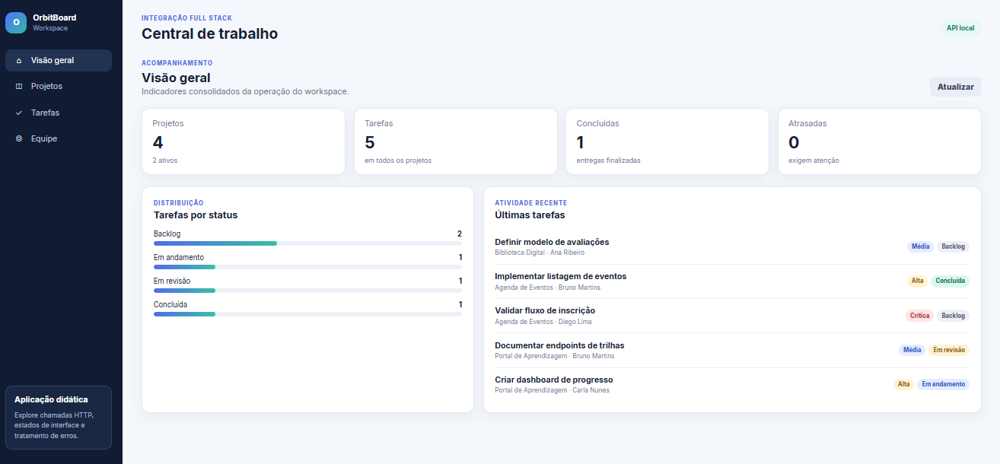
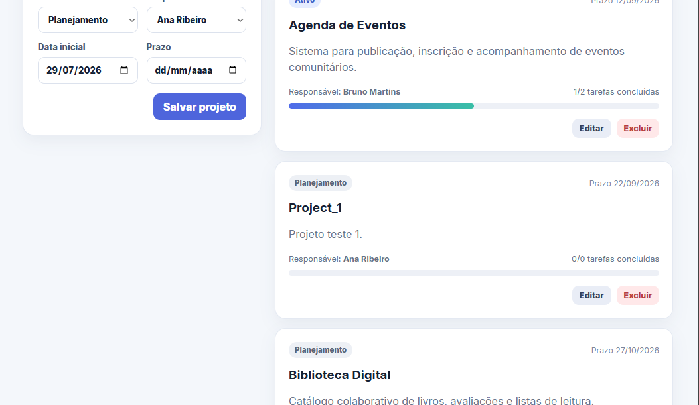
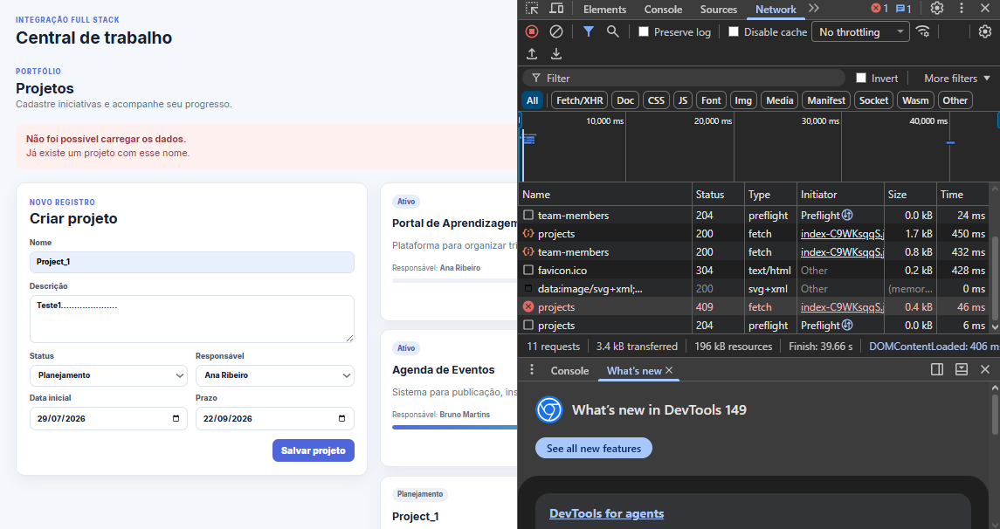
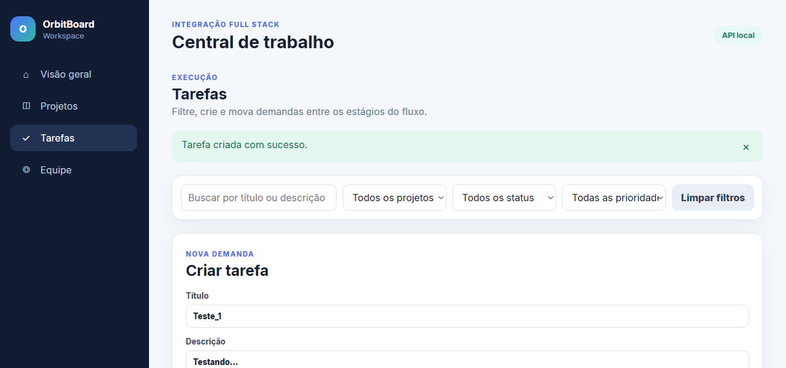
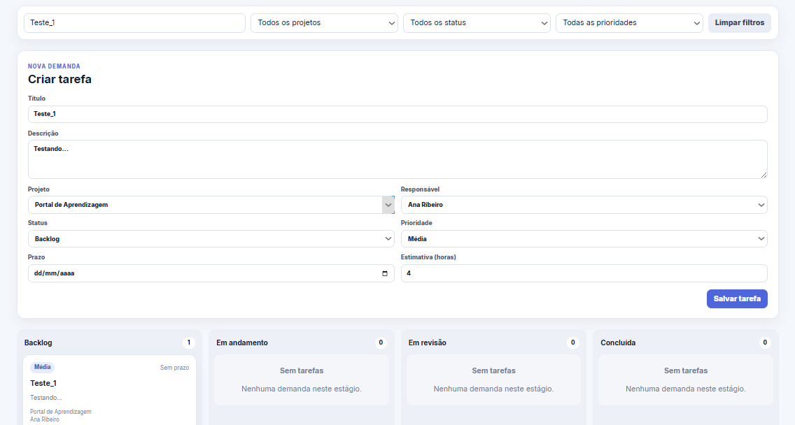
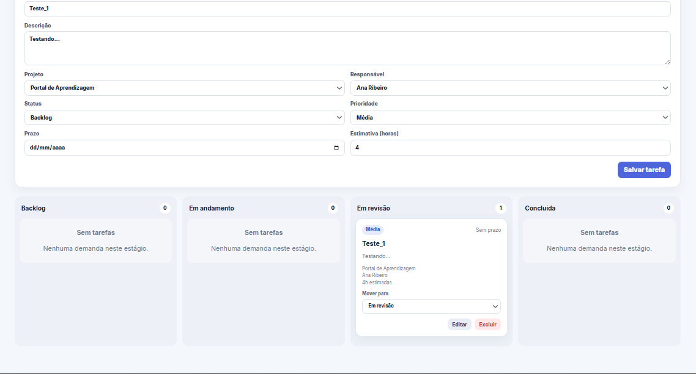

# Evidências de Testes — OrbitBoard

> **Responsável pela Fase 5:** José Victor · **Revisão:** Leandro Henrique
> **Ambiente:** aplicação conteinerizada via `docker compose up --build`
> **URLs:** Frontend `http://localhost:5173` · API `http://localhost:5200` · Swagger `http://localhost:5200/swagger`

---

## Como este documento foi produzido

Todos os testes abaixo foram executados com a aplicação rodando via Docker Compose
(backend e frontend conteinerizados). Cada print está salvo em `docs/img/` e é
referenciado inline. Os testes seguem os fluxos oficiais sugeridos no `frontend/README.md`.

**Como reproduzir:**

```bash
# Na raiz do repositório
docker compose up --build
```

Depois, acessar `http://localhost:5173` (dashboard) e `http://localhost:5200/swagger` (API).

---

## Parte 1 — Testes funcionais (fluxos da aplicação)

### Teste 1 — Dashboard carrega com métricas

**Ação:** abrir `http://localhost:5173` e conferir os indicadores consolidados.
**Resultado esperado:** métricas preenchidas com dados vindos da API (projetos, tarefas, distribuição por status).



**Resultado observado:** _(preencher: ✅/❌ e uma frase)_

---

### Teste 2 — Criar projeto válido

**Ação:** em **Projetos**, criar um novo projeto com dados válidos.
**Resultado esperado:** `201 Created` e o projeto aparece na lista.



**Resultado observado:** _(preencher)_

---

### Teste 3 — Criar projeto com nome duplicado (erro 409)

**Ação:** tentar criar outro projeto com um nome já existente.
**Resultado esperado:** `409 Conflict` e mensagem de erro tratada na interface.



**Resultado observado:** _(preencher)_

---

### Teste 4 — Criar tarefa associada a um projeto

**Ação:** em **Tarefas**, criar uma tarefa vinculada a um projeto existente.
**Resultado esperado:** `201 Created` e a tarefa aparece listada.



**Resultado observado:** _(preencher)_

---

### Teste 5 — Filtrar tarefas por status e prioridade

**Ação:** aplicar filtros de status e prioridade na página de Tarefas.
**Resultado esperado:** a lista é filtrada corretamente conforme os critérios.



**Resultado observado:** _(preencher)_

---

### Teste 6 — Alterar o status de uma tarefa pelo quadro

**Ação:** mover/alterar o status de uma tarefa no quadro.
**Resultado esperado:** a alteração é persistida (`PUT`/`PATCH` → `200`) e refletida na tela.



**Resultado observado:** _(preencher)_

---

### Teste 7 — Editar e excluir uma tarefa

**Ação:** editar os dados de uma tarefa e, em seguida, excluí-la.
**Resultado esperado:** edição salva com sucesso; exclusão remove a tarefa da lista.


**Resultado observado:** _(preencher)_

---

### Teste 8 — Excluir projeto que ainda possui tarefas (conflito)

**Ação:** tentar excluir um projeto que tem tarefas associadas.
**Resultado esperado:** erro de conflito tratado, impedindo a exclusão indevida.


**Resultado observado:** _(preencher)_

---

## Parte 2 — Evidências de comunicação HTTP (DevTools)

Com o dashboard aberto, abrir o **DevTools (F12) → aba Network → recarregar (Ctrl+R)**
e capturar as requisições à API.

### Chamadas de rede com status 200

**Esperado:** requisições para `/api/dashboard`, `/api/projects`, `/api/tasks`
retornando `200`, com o preflight CORS (`OPTIONS` → `204`) antes das chamadas.


**Resultado observado:** _(preencher)_

### Corpo da resposta em JSON

**Esperado:** ao clicar numa chamada → aba **Response**, o JSON retornado pela API.


**Resultado observado:** _(preencher)_

---

## Parte 3 — Evidências de infraestrutura (containers)

Executar num terminal, com o compose rodando:

```bash
docker compose ps
docker images | Select-String "orbit-board"
docker compose logs backend --tail 30
docker compose logs frontend --tail 30
```

### Estado dos containers


### Imagens construídas


### Logs dos containers


**Observação sobre o multi-stage:** a imagem final do backend usa apenas o runtime
`aspnet:8.0` (não o SDK completo), e a do frontend serve estáticos via `nginx:alpine`
(sem Node) — o tamanho reduzido nas imagens comprova o efeito do build multi-stage.

---

## Parte 4 — Erros encontrados e correções aplicadas

Esta seção atende diretamente ao critério "Testes, evidências e análise de erros".

### Erro 1 — Backend "unhealthy" no primeiro `docker compose up`

**Sintoma:** o backend subia normalmente (`Application started`), mas o Compose
reportava `container orbitboard-backend is unhealthy` e o frontend não iniciava
(dependência falhava).

**Causa:** o healthcheck usava `wget`, que não existe na imagem slim
`mcr.microsoft.com/dotnet/aspnet:8.0`. O comando de teste falhava, e o Docker
interpretava o container como doente — mesmo com a API respondendo.

**Correção:** removido o healthcheck por comando e substituída a condição
`depends_on: service_healthy` por `depends_on` de ordem de inicialização.
Suficiente para a aplicação (a API sobe em segundos) e sem dependência de
ferramentas ausentes na imagem.

### Erro 2 — _(preencher se surgir outro durante os testes)_

**Sintoma:** _(preencher)_
**Causa:** _(preencher)_
**Correção:** _(preencher)_

---

## Resumo

## Resumo

| # | Teste | Status |
|---|---|---|
| 1 | Dashboard com métricas | [Ver Imagem](img/01-dashboard.png) |
| 2 | Criar projeto válido (201) | [Ver Imagem](img/02-criar-projeto.png) |
| 3 | Nome duplicado (409) | [Ver Imagem](img/03-erro-409.png) |
| 4 | Criar tarefa | [Ver Imagem](img/04-criar-tarefa.png) |
| 5 | Filtrar tarefas | [Ver Imagem](img/05-filtro-tarefas.png) |
| 6 | Mudar status no quadro | [Ver Imagem](img/06-status-tarefa.png) |
| 7 | Editar e excluir tarefa | [Ver Imagem](img/07-excluindo-tarefa.png) |